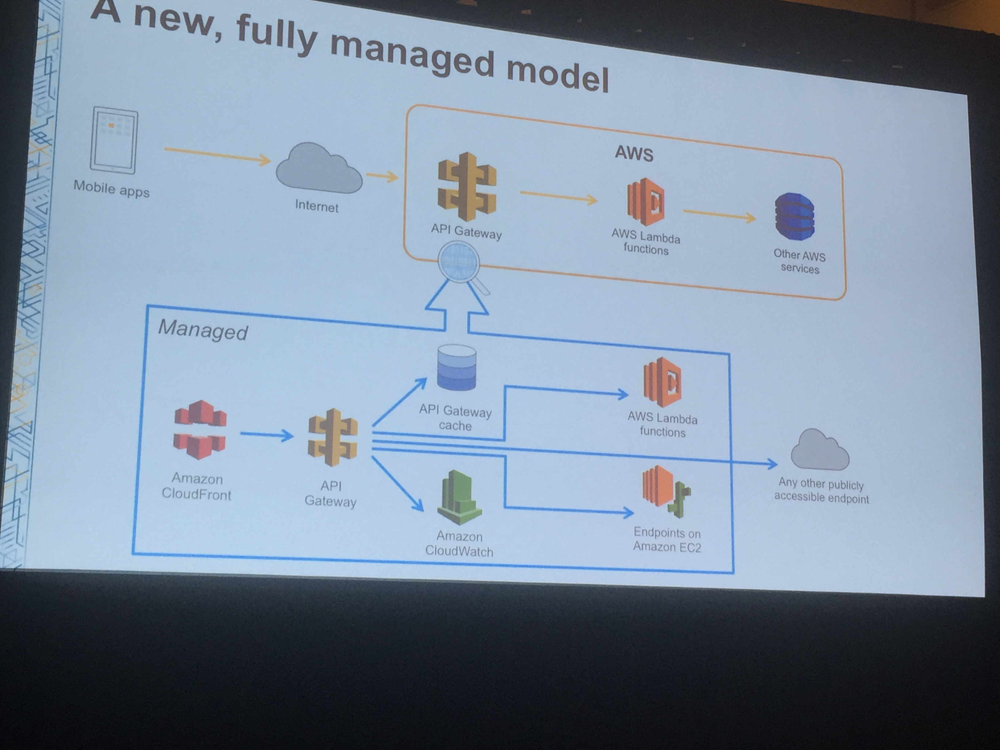
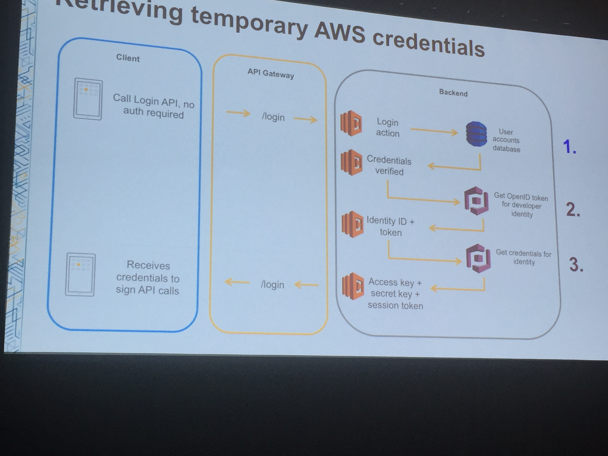

# Using Amazon API Gateway with AWS Lambda to Build Secure and Scalable APIs
### Wednesday, Oct 7, 2015 4:15PM
#### DEV 203
#### Stefano Buliani 

## Takeaway

* CHeck out Swagger import and client SDK
* API Gateway kills Parse
* Dry, but wow!  Such good information.  Very technical. 
* Stateless execution is the best way to scale. 
* No VPC integration

## Outline

1. Understand the model
2. Declare API with API Gateway
3. Application Logic with AWS Lambda
4. Register and login API with Amazon COgnito
5. Authorization with AWS IAM

## New fully managed model



1. No infrastructure to manage and scaling is simple. 
2. Security important and complex so AWS identity takes care of it. 
3. Swagger import and client SDK - wcan automate most workflows.  

## Pet Store architecture 

In this application we  Handle 2 cases: Unauthenticated and Authenticated requests

1. Doesn't manage any servers. 
2. Autorization of API calls is delegated to AWS.  We just focus on our IAM roles. 
3. Deployment of API is automated by Swagger. 

## API Definition and Swagger

#### Amazon API Gateway Overview
* Define and host APIs
* Manage network traffic
* Leverage AWS Auth

Best thing is AWS manages our app like we were an AWS service ourselves. 

Basic workflow: 

```
Method -> Method Request -> Integration Request -> To Lambda -> Integration Response -> Method Response
```
Method Request and Method Response shouldn't change.  The rest could change. 

Create Resources
Unauthenticated: 
* /users
* /login
Authenticated
* /pets
* /pets/{petid}

### Automating the workflow with Swagger

Create a YAML file that defines the entire API: 
```
/users:
  post:
    summary: Registers a new user
    consumes: 
      - application/json
    produces: 
      - application/json
    parameters: 
      - name: NewUser
        in: body
        schema:
          $ref: '#/definitions/User'
    tags:
      Auth
    x-amazon-apigateway-integration: 
      type: aws
      uri: ...
      credentials: ... 
      httpMethod: POST
      requestTemplates: 
        application/json: |
          {
              action: "com.amazonaws.apigatewaydemo.action.CreatePetDemoAction", 
              body : $input.json('$')
          }
      ...
}
```
To import: 
```
./aws-api-import.sh --create /path/to/swagger.yaml
```

## Request Routing and exceptions

AWS Lambda Overview: Stateless, trigger-based code execution

* purchase compute in 100ms increments

lambdaHandler can be written in java or Javascript.  

Set up responses for 400 and 200 

Mapping templates are a powerful tool: 
[More information on mapping templates](http://amzn.to/1L1hSF5)

## Retrieving AWS credentials

Amazon Cognito is an identity management service.  Can integrate with Facebook, 
or your own that you create with AWS. 

* Manage authenticated and guest users across identity providers
* Securely access AWS services
* Syncronize across the cloud



Code goes through and searches through dynamoDB for user, then authenticates with
cognito. Identity is saved.  This is then saved into creds and returned to the person. 

Different roles show that API gateway function can call DynamoDB, API Gateway, or Lambda
This allows the infrastructure to call other AWS services in authenticated, trackable way. 

## Generated SDK benefits

Creates boiler plate code that can be used for the applications.  

## Conclusion

1. AWS Lambda + API Gateway means no infrastructure

[Download the sample code](https://github.com/awslabs/api-gateway-secure-pet-store)
