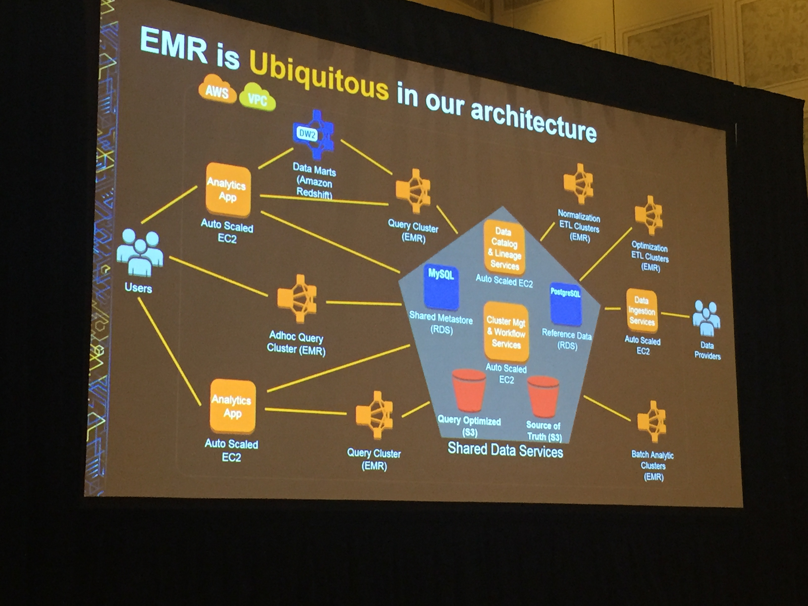

# EMR Deep Dive & Best Practices
##### Rahul Pathak, AWS
##### Scott Donaldson, FINRA
##### Clayton Kovar, FINRA

## Agenda
* Update on latest
* Info on advanced capabilities
* Tips for lowering costs
* Deep Dive how FINRA uses Amazon EMR and Amazon S3. 

## EMR
Managed clusters for Hadoop, Spark, Presto, or others in the Apache/Hadoop Stack
* EMRFS - looks like HDFS but has connectors to S3, DynamoDB, Kinesis, Redshift, and KMS
* Integrate with VPCs, IAM, S3, etc. 
* Built in support ofr resizing clusters
* Integrated with the Spot market

HiPPA compliance since July 2015

## New Features of EMR
EMR Release 4.1
* Hadoop KMS with transparent HDFS encryption support
* Spark 1.5, Zeppelin 0.6
* Presto 0.119, Airpal
* Hive, Oozie, Hue 3.7.1
* Simple APIs for luanch and configuration

Intelligent Resize
* Incrementally scale up based on available capacity
* Wait for work to complete before resizing down. 
* Can scale core nodes and hdfs as well as task nodes. 

## Leverage Amazon S3 with EMR FilesSystem (EMRFS)

Use S3 as persistent data store

* Separate compute and storage
  * As data gets stale, you don't have to add nodes just to keep that around. 
* Resize and shut down EMR clusters with no data loss
* Point muliple EMR clusters at the same data in S3
* Easily evolve your analytic infra as tech evolves. 
  * New version every week of some Hadoop stuff. 

## EMR makes it easier to use S3
* read after write consistency
* fast list operations
* error handling options
* support for s3 encryption
* transparent to applications: s3://

## HDFS to S3

makes it so HDFS can call the location being an S3 bucket. 
```
CREATE EXTERNAL TABLE serde_regex(
host STRING...
```

## HDFS is still there if needed
* Iterative workloads
  * if youre processing same dataset more than once
  * Consider using Spark & RDDs for this too

* Disk I/O intensive workloads
  * Persist data on S3 and use S3DistCp to copy to/from HDFS for processing. 
## Optimizing storage formats

File formats, bring in raw data, then ouptput will be based on what system will use to use it. 

## Factors to consider
* Processing and query tools: Hive, Impala, Presto
* Avro for schema and Presto for storage
* File format "splitability"

Small files are bad (anything under 100MB should be avoided)
Each mapper is a single JVM

* change the blocksize
* You can use S3DistCp to combine smaller files 

## Compression
Always compress data files on S3
* bzip: high compression, slow decompress
* gzip: high cmopression, medium decompress

## Cost Savings
* Use S3 as persistent data store - query it using Presto, Hive, Spark, et
* Only pay for compute when you need it. 
* Use EC2 Spot instances and save > 80%
* Use EC2 Reserved instances for steady workloads.

## EMR & Anlytics with FINRA

* 75 billion events per day
* $600 billion every day. 

Rows are very wide.  They have 5PB of data.  The idea is they look for market manipulation, inside trading, etc. 

Insider trading case of 32 inside trading.  Newswires services got $100 million in illegal profits. 



* S3 is the durable system of record
* FINRA Data Manager is open sourced
* Text format for archival copies on S3 & Amazon Glacier
* Compressed with bzip

Have to save data for 7 years
20,000 ticker signals

Used a hash algorithm that used 100 buckets of where the data files go. That gave them 250 MB of data instead of smaller datasets. 

#### Data security

* encryption of all data both at-rest, and in-transit
* S3 server-side encryption 
  * Came to the conclusion that security is better in the cloud than on prem. 
* Encrypt ephemeral storage on master, core, and tasks node
* Use security groups to make sure only client apps talk to master. 

#### Why EMR? 

* Cost.  Each table is 600 TB. Instead of storing on EC2 instances goes from $4.5 million/year to S3 -> $120k/year
* Data locality is desirable but not practical for our scale
  * 15% - 20%  more time to use EMR but worth it for management headache. 

#### Adaptation

* take advantage of new instance types
* find the right types for workloads
* prefer smaller cluster of larger nodes: 4XL
* millions of partitions, more memory is needed for the master node (HS2)
* Use CLI based scripts rather than console -> Infra is code
