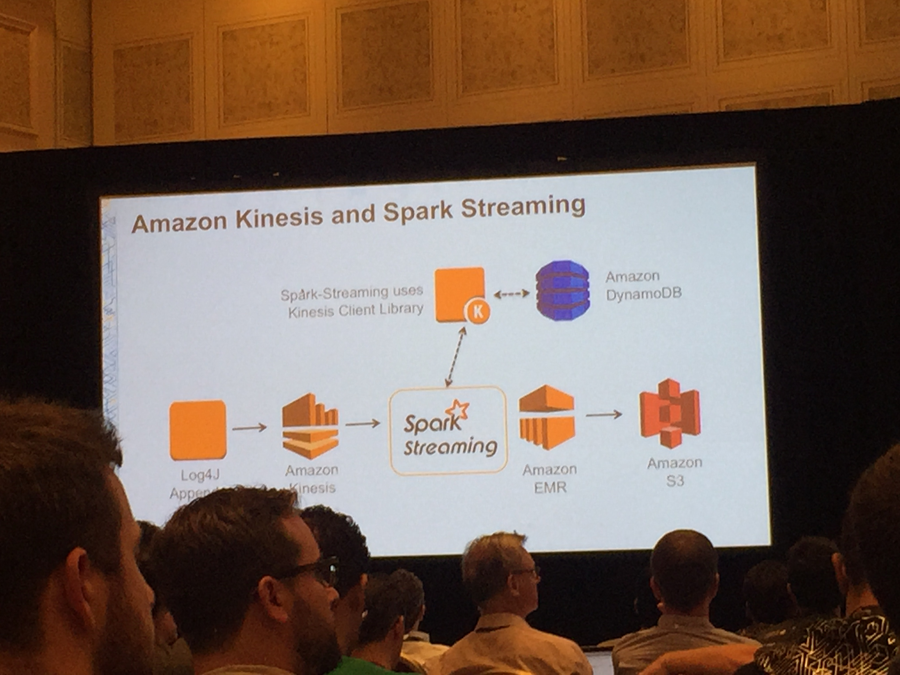

# BDT2015 Your first big data application on AWS (Wed Oct 7, 2015 11AM)
### Matt Yanchyshyn, 
* I like his deep voice. 
* Very good speaker, simplifys things very well. 
* Everybody is on Slack around here. 

There are a lot of tools with AWS for big data and focus on the business
processing.  

## Common design patterns: 
* Logs
* Kinesis
* S3
* EMR (Spark streaming)
* Redshift
* app that shows apps. 

## Collecting

First thing we have to put data into the system. 
Logs -> Kinesis -> S3
 
## Process Data

Spark streaming is different than Spark stuff

## Anazlye
S3 -> Redshift -> To the application

## Creating The Application
Create Kinesis stream
```
aws kinesis create-stream --stream-name AccessLogStream --shard-count 1
```
Create S3 bucket.  Multiple tools can use it in parallel. 
```
aws s3 mb s3://<your bucketname>
```
Create a cluster. 
```
aws emr create-cluster --name "demo" \
--instance-type m3.xlarge \
--instance-count 2 \
--release-label emr-4.1.0 \
--ec2-attributes KeyName=Your-AWS-SSH-KEY --use-default-roles \
--use-default-rules
--applications Name=Hive Name=Spark
```
This will create Spark and Hive apps on this cluster.  Gets rid of _Undifferentiated Heavy Lifting_

IsengardAdministrator

Now create a redshift cluster

```
aws redshift create-cluster \
--cluster-identifier demo \
--deb-name demo \
--node-type dc1.large \
--cluster-type single-node
--master-username master
--master-user-password PASSWORD \
--publicly-accessible \
--port 8192
```

Redshift is column based database

ETL process will be taking things out of the events and storing. 



Now SSH into the cluster.  Then launch the Spark shell: 
```
spark-shell --jars /usr/... --driver-java-options "..."
```
If the whole point is to push data into RedShift you can use Firehose. The streaming framework normalizes things. 


