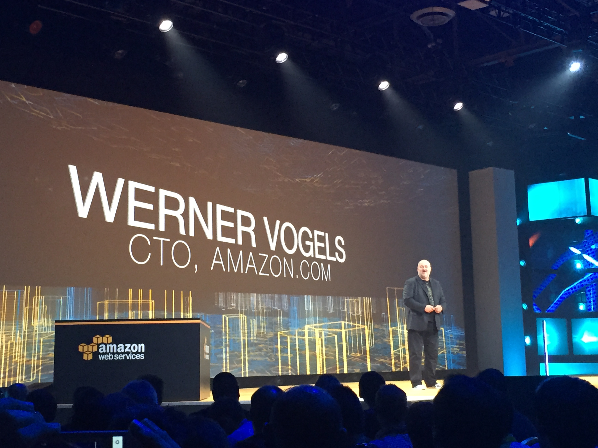

# Keynote - Werner Vogels

## Announcements

* Amazon Kinesis Analytics (POwerful SQL-Based, Time Series analytics)
* New instance: X1: 2 TB of Memory available in 2016
* New instance: t2.nano 512MB
* EC2 Container Registry
* AZ-Aware Service Scheduler
* Docker integration with Compose
* ECS CLI
* VPC Support for Lambda
* Long-running functions (5 mintues)
* Scheduled Functions for Lambda
* Custom Retry Lambda
* Python for Lambda
* AWS Mobile Hub to simplify mobile development
* AWS Device Farm





## New whitepaper to help people work better

AWS Well-Architected Framework

## The Cloud Removes Constraints

## Build Applications the way we always wanted

## Six Laws Every Cloud Architecture Should Know

### 1. Lucas Critique
"It is naive to try to predict the effects of a change entirely on the bassis of relationships observed in historical data"

* Past Data
* Realtime analytics
* Machine Learning for future predictions

Real-Time STreaming Data with Amazon Kinesis Streams
* ubisoft
* sonos
* mlbam 
* mediamath
* hearst
* Adroll
* acquia
* coinbase: 1 billion transactions per day

#### Streaming Data Processing is Still Challenging

Announcing Kinesis Analytics: 3 steps to analytics
```
Kinesis analytics -> Kinesis Firehose -> Redshift -> Quicksight
```

### 2. Gall's law
complex systems evolv from simple systems, not made from scratch. 

Right now you can build from: 

####  VMs
  * New VMs. 
#### Containers
* many customers using: Expedia, Coursera (batch processing)
* Still lots of undifferentiating heavy lifting.   
* Announces EC2 Container Registry 
* AZ Aware Service Scheduler
* Docker integration with compose
* ECS CLI

```
ecs-cli up
ecs-cli compose up
```                        

#### Lambda
No server is easier to manage than no server

##### New Features since Lambda was rolled out
* Cloud Formation Support
* Integration with SNS, SWF, ASK
* API Gateway Integration
* Java
* Mobile SDK and Cognito Integration

Today, 4 more features announced. 

### 3. Law of Demeter

Each unit should have only limited knowledge of its own domain. 
How can we simplify the development of the next generation of mobile apps? 


### 4. Occam's razor
the one with the fewest assumptions should be selected

Book: [The Forth Paradigm](http://www.amazon.com/The-Fourth-Paradigm-Data-Intensive-Scientific/dp/0982544200)

Lot's more talk about analytics and doing things with data that has
been collected.  This is for prediction. 

More applications doing prediction analysis with location.

Werner talks about all the new style applications that are more connected with sensors and devices. 

Sports data is more and more important.  

### 5.

### 6.              

## Guest Speakers

### Jason Fischl, VP of engineering, Remind
Mission is to connect every teacher, student, and parent in the world.  

Very seasonal with 'Back to School'.  Every August, usage is higher than ever been. 

[Empire Development Platform](https://github.com/remind101/empire)

Provides a Heroku like platform that sits on top of Containers. 

### Deiter May , SVP Digital Business Models at BMW

Brand new luxery car BMW 7 Series

* 116,324 employees
* 30 production and assembly plants in 14 countries
* 2.118 mi vehicles sold in 2014
* 80.4 bn euro revenue in 2014

Despite these successes, there are lots of disruption coming. 

* Integration of Car as powerful IoT device
* Automatic driving cars
* Mobility services spreading across the world
* Less differentiation through hardware and more through digital
