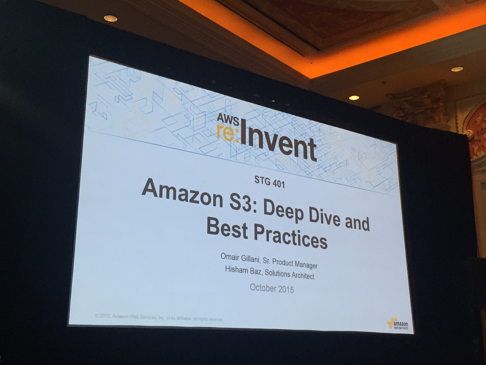
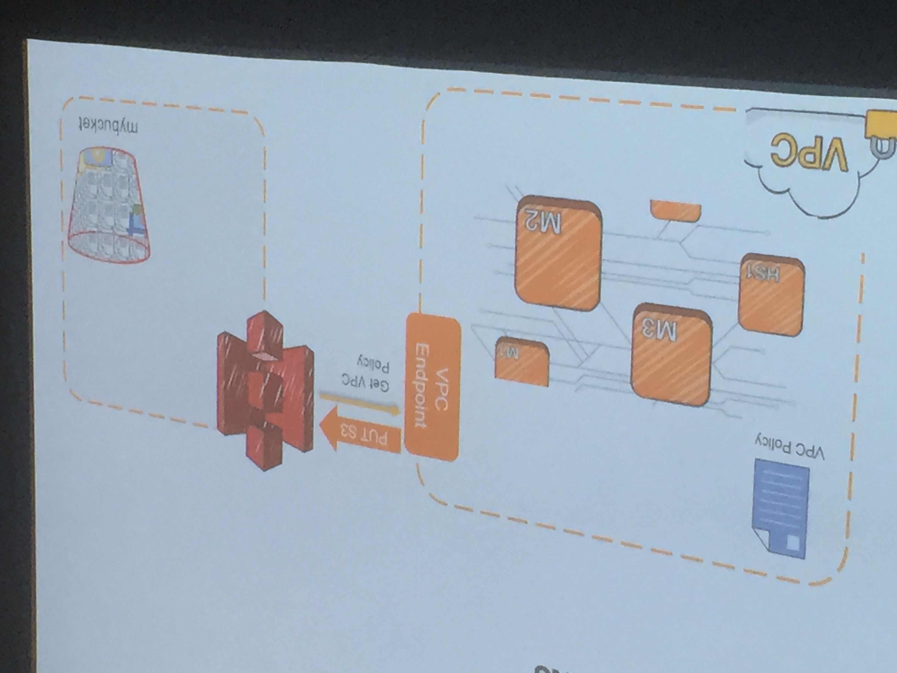

# Amazon S3: Deep Dive and Best Practices (Wed Oct 7, 2015 @ 2:45)
#### STG 401
#### Omair Gillani, Sr. Product Manager
#### Hisham Baz, Solutions Architect



## Take Aways
* S3 is the most amazing product: Serverless Infrastructure. 
* Lifecycle capability saves costs

## New for 2015
* Amazon S3 Standard-IA (Infrequent Access)
* Event notifications
* Cross-region replication
* VPC endpoint for Amazon S3
  * Means that private AWS vpcs can talk to endpoints. 
* Amazon Cloudwatch metrics for Amazon S3
  * Alarms for when too many peaks of data. 
* AWS CloudTrail support for Amazon S3
  * Who is creating buckets, when, where, etc. for compliance. 
* Amazon S3 bucket limit increase
  * See how much is being done by multiple groups. 
  * 100 bucket is current limit but can be increased. 
* Read-after-write consistency in all regions
  * all clients see a consistent state

## Example product: Video sharing service.  VidShare. 

Always start with the customer and work backwards. Requirements: 
* Scale
* Low latency, etc. 

RoadMap: 
* Launch
  * Scale to millions of users
  * focus on US
  * create thumbnails for playback. 
* V2
  * optimize cost
* V3 
  * Expand globally
* V4
  * Enterprise enablement
  
### V1 initial Design

Make notifications when PUT, POST, COPY or multipart upload.  Events can be
Lambda, SQS Queue, SNS topic

In the bucket, watch for ObjectCreated(All) give it a name uploadVideo.  Anything that 
gets put into the videos/ prefix.  Also look for suffix.  

Call a lambda function to do something when its created. 

Notifications can fire into the buckets.  Web app can respond to events. 

### V2 Optimize Cost

#### standard IA
* 11 9's of durability
* Availability 99.9% 
* Same throughput as S3 standard storage
* Easy to use REST interface.
* Secure server-side encryption with your encryption keys. 
* Integrated. 

As data lifecycle changes, data migrates from standard, to standard IA, to Glacier. 

#### Demo

Lifecycle Rules: Transition to S-I after 30 days if object is not used.  Move to Glacier after certain time
Delete it after another timeframe. 

1 PB example.  On S3, $28,816/month.  1PB for S3 Standard-IA is $17,600/month on storage cost.  Saving 39%

### V3 Global Expansion

S3 cross-region replication is fast, automated, and reliable. Once data is copied into one bucket it can automatially
be replicated to a bucket in another region. 

* Replication status can be determined by the ```HEAD``` in the S3 call. 
* Object ACL updates are replicated. 
* Can replicate into Standard-IA or Glacier

Bucket A in one region, Bucket B in another region.  

Cross Region replication policy is very easy.  (If its the same account)

#### Demo
* Create a role
* Create a policy
* Create versioning
* Enable replication

PUTS and DELETEs are replicated.  

### V4 Enterprise Enablement 

Amazon S3 VPC endpoints access Amazon S3 from your Amazon VPC using VPC endpoints. 
* Don't have to manage NATs and Internet Gateways. 
* Imporved throughput from VPC resources to Amazon S3
  * High availability
* Lower Cost by avoiding expensive NAT, Internet Gateways.  



Control access to buckets from specific VPCs.  Can allow only certain VPCs or deny several VPCs. 

#### Demo

Use Amazon WorkSpaces.  Creates desktop that has access only through certain VPC. 

* Endpoints 
  * Select VPC
  * Policy to allow access which endpoints. 
  * which Route tables it applies to. 
  
A new route is created in the VPC table.  The most specific route will win. 

This will make it so certain access is denied. 

### Security & Analysis

Last part is to understand what is happening to the data
* configuration
* access
* frequency

CloudWatch: Alarm if specific API called. S3 metrics added as well. 
CloudTrail: Track multiple services. Who's making changes.  

